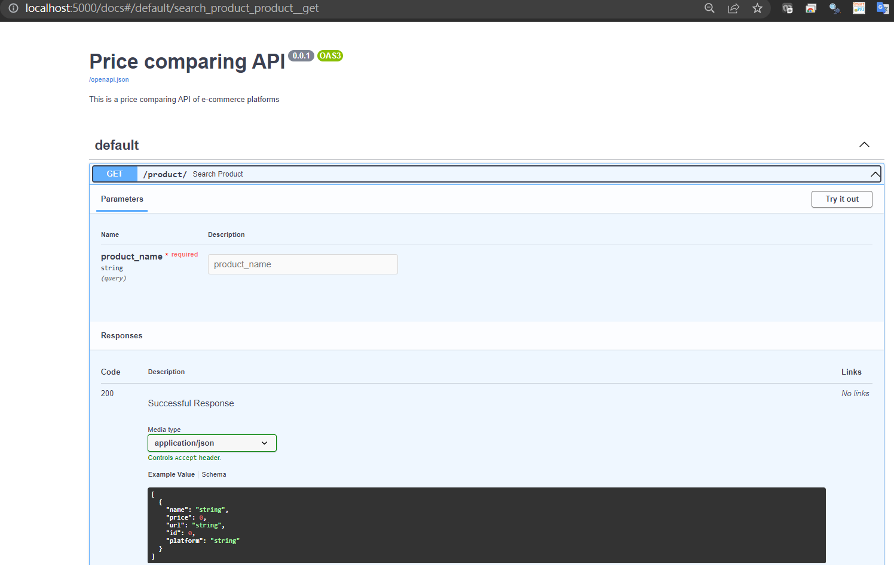
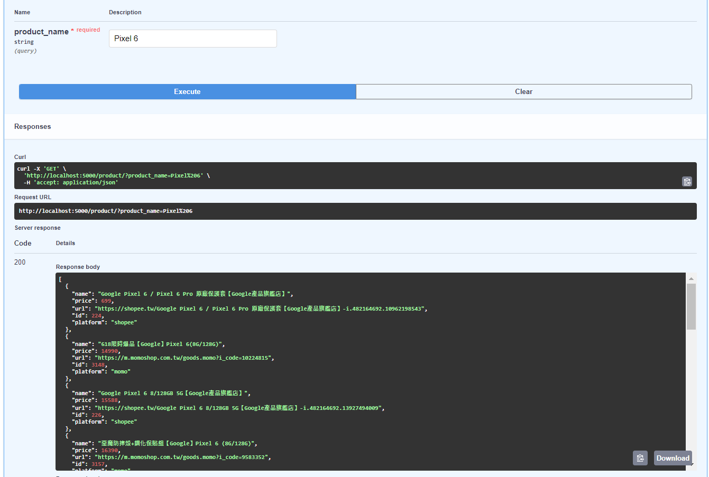

# 商品價格比較

## 功能
- 爬取電商平台官方店家商品
- 關鍵字搜尋商品，列出各電商平台相關產品與價格

## 啟動步驟
1. 建立設定檔:
   ```
   cd backend
   touch .env
   # 編輯 .env 指定 DB_URI 參數
   ```
2. 啟動資料庫:
   ```
   docker-compose up db -d
   ```
3. 啟動 API:

   ```
   docker-compose up price-api -d
   ```
4. 定時(POC 時手動)啟動爬蟲:
   ```
   # 手動
   docker-compose up crawler -d

   # crontab 每日啟動
    0 1 * * * cd /path/to/backend; docker-compose up crawler -d
   ```

## API 測試畫面



